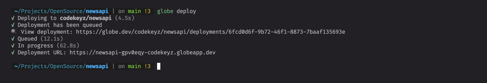

# Flutter + Firebase Auth + Shelf Backend

## Overview

Build a Simple Notes App using Flutter Web, Firebase Auth and Dart for our backend.

### Getting Started

#### Bootstrap

Initialize your project using the `notes_app_shelf`

```shell
$ globe create -t notes_app_shelf
```

#### Setup Firebase Project

You must create a Firebase account, generate Firebase Admin Service Account and download.

To generate a private key for your service account:

- In the Firebase console, open **Settings** > **[Service Accounts](https://console.firebase.google.com/project/_/settings/serviceaccounts/adminsdk)**
- Click **Generate New Private Key**, then confirm by clicking **Generate Key**
- Securely store the JSON file containing the key.

#### Setup Local Variables

- Add this command to your `.bashrc` or `.zshrc` file.

  ```shell
  export GOOGLE_APPLICATION_CREDENTIALS=$(cat <path-to-service-account-file>.json)
  ```

- Create a `.env` in the server directory and add the `FIREBASE_PROJECT_ID` variable

  ```.env
  FIREBASE_PROJECT_ID=
  ```

#### Link Frontend with Firebase

Follow the guide at https://firebase.flutter.dev/docs/cli to link the `frontend` project with existing/newly created Firebase project.

> You should have a `firebase_options.dart` generated after completing this step.

### Running Project

#### Server

In the server directory, run the command below to start the Dart Shelf server.

```shell
$ dart run bin/server.dart
```

#### Frontend

In the frontend directory, run the command below to start the Flutter Web App.

```shell
$ flutter run -d chrome
```

### Deployment

#### Setup Globe CLI

You can deploy with a single command on [Globe](https://docs.globe.dev/). To install the Globe CLI, run the following command:

```shell
$ dart pub global activate globe_cli
```

To login with your Globe account, run the following command:

```shell
$ globe login
```

#### Deploy Server

In the `server` directory, run the following command:

- Link Project to Globe

  ```shell
  $ globe link
  ```

  

- Navigate to your project settings on Globe dashboard and add environment as shown below.

  

- Deploy to Globe

  ```shell
  $ globe deploy
  ```

  

#### Deploy Frontend

Inside `frontend/lib/main.dart` file, replace `https://your-project.globeapp.dev` with the `Deployment URL` from our server deployment.

Now run this command to deploy your frontend 🚀

```shell
$ globe deploy
```
